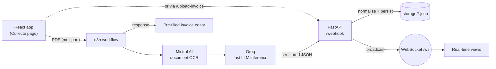

<div align="center">

# Digi Compta

**AI-powered invoice OCR and automation platform for Tunisian accounting firms**

Upload a PDF invoice → get clean, structured, editable data in seconds, pushed live to every connected user.

[](https://react.dev/)
[](https://www.typescriptlang.org/)
[](https://fastapi.tiangolo.com/)
[](https://n8n.io/)
[](https://mistral.ai/)
[](https://groq.com/)
[](./LICENSE)

**[▶ Watch the demo video](https://drive.google.com/file/d/1n0501bvizbNDYL1gMotUayX-s-Gg-oV5/view?usp=sharing)**

</div>


---

## Contents

- [Overview](#overview)
- [Features](#features)
- [Architecture](#architecture)
- [Engineering Highlights](#engineering-highlights)
- [API Reference](#api-reference)
- [Tech Stack](#tech-stack)
- [Getting Started](#getting-started)
- [Project Structure](#project-structure)
- [Project Status & Roadmap](#project-status--roadmap)
- [Screenshots](#screenshots)
- [License](#license)

---

## Overview

Accounting firms in Tunisia still spend hours typing invoice data by hand: supplier details, VAT numbers, line items, totals. The work is repetitive, slow (5–10 minutes per invoice) and error-prone.

**Digi Compta automates that step.** A PDF dropped into the web app is sent to an **n8n** workflow that uses **Mistral AI** and **Groq** to extract the invoice as structured JSON. The result is normalized, pre-filled into an editable invoice form for review, stored, and broadcast over **WebSocket** to every connected client.

| Before | With Digi Compta |
|:--|:--|
| Manual entry of every invoice | Drag-and-drop a PDF, data is extracted automatically |
| 5–10 minutes per invoice | A few seconds per invoice |
| Frequent transcription errors | AI extraction + human review in a pre-filled form |
| No shared visibility | New invoices appear live for the whole team |

---

## Features

- **PDF collection:** drag-and-drop upload with local storage (IndexedDB), in-app preview and deletion
- **AI extraction:** supplier (name, VAT number, address, phone, email), invoice number, date, currency, line items, subtotal, VAT and total
- **Robust normalization:** handles French/English field names, French number formats (`1 234,56` → `1234.56`), currency symbols and the different response envelopes n8n can return
- **Invoice editor:** extracted data pre-fills a validated form with editable line items
- **Real-time feed:** the backend broadcasts every processed invoice over WebSocket
- **Accounting workspace UI:** dashboard, client records, tax returns (TVA / IR), national platforms (CNSS, JIBAYA, RNE), archiving and user roles *(see [status](#project-status--roadmap))*

---

## Architecture



**Pipeline, step by step**

1. The user drops a PDF on the **Collecte** page; it is saved to IndexedDB for offline preview.
2. The file is posted to the n8n webhook (directly, or proxied through FastAPI's `/upload-invoice`).
3. The n8n workflow runs the document through Mistral AI and Groq and returns structured JSON.
4. The response is normalized and opened in the **invoice editor** for review and correction.
5. n8n also posts the result to FastAPI's `/webhook`, which normalizes it, stores the raw and normalized payloads, and broadcasts the invoice to all WebSocket clients.

---

## Engineering Highlights

**Tolerant data normalization.** LLM output is inconsistent from one invoice to the next. The normalizer accepts many shapes for the same data (`supplier` / `vendor` / `seller`, `lines` / `items`, `qty` / `qte` / `quantity`, `invoice_number` / `invoiceNo` / `invoice_id`…), unwraps n8n envelopes (`[...]`, `{json}`, `{output}`), parses French-formatted numbers and recomputes missing totals (19% VAT). The same logic exists in both [TypeScript](src/lib/normalizeInvoice.ts) and [Python](main.py), so the frontend and backend always agree on the invoice shape.

**Graceful degradation.** The invoice editor tries its data sources in order (router state → last stored extraction → live extraction → demo invoice), so the UI stays usable even when n8n or the backend is offline.

**Real-time broadcasting.** A small connection manager in FastAPI keeps track of WebSocket clients, pushes every processed invoice to all of them, and drops dead connections automatically.

**No-code-friendly orchestration.** The AI pipeline lives in n8n, so prompts, models and validation steps can be changed visually without redeploying the app.

---

## API Reference

FastAPI backend ([`main.py`](main.py)), default `http://127.0.0.1:8000`. Interactive docs at `/docs`.

| Method | Endpoint | Description |
|:--|:--|:--|
| `POST` | `/webhook` | Receives extraction results from n8n; normalizes, stores and broadcasts them |
| `POST` | `/upload-invoice` | Accepts a PDF and forwards it to n8n (`N8N_UPLOAD_URL`) |
| `GET` | `/pdf-data` | Returns the latest extracted invoice (or a demo invoice) |
| `GET` | `/invoice?id=` | Returns a saved invoice |
| `POST` | `/invoice` | Saves an edited invoice |
| `GET` | `/health` | Health check |
| `WS` | `/ws` | Real-time stream of processed invoices |

---

## Tech Stack

| Layer | Technologies |
|:--|:--|
| **Frontend** | React 18, TypeScript, Vite, Ant Design 5, React Router, Zustand, Recharts, IndexedDB |
| **Backend** | Python, FastAPI, Uvicorn, httpx, Pydantic, WebSockets |
| **AI & automation** | n8n (workflow orchestration), Mistral AI (document OCR), Groq (fast LLM inference) |

---

## Getting Started

### Prerequisites

- Node.js 18+
- Python 3.10+
- [n8n](https://docs.n8n.io/) (self-hosted or cloud) with Mistral and Groq API credentials

### Installation

```bash
git clone https://github.com/MohamedHouij03/Frontend_digi_compta.git
cd Frontend_digi_compta

# Frontend
npm install

# Backend
python -m venv venv
source venv/bin/activate        # Windows: venv\Scripts\activate
pip install -r requirements.txt

# Configuration
cp .env.example .env.local      # then edit the n8n webhook URLs
```

### Configuration

| Variable | Used by | Description |
|:--|:--|:--|
| `VITE_N8N_WEBHOOK_URL` | Frontend | n8n webhook that receives uploaded PDFs |
| `VITE_N8N_EXTRACTION_URL` | Frontend | Optional endpoint for the latest extraction (defaults to `/api/pdf-data`) |
| `VITE_N8N_INVOICE_API_URL` | Frontend | Optional invoice API (defaults to `/api/invoice`) |
| `VITE_API_BASE` | Frontend | Backend base URL (defaults to `/api`, proxied by Vite) |
| `VITE_WS_BASE` | Frontend | WebSocket base URL, e.g. `ws://127.0.0.1:8000` |
| `N8N_UPLOAD_URL` | Backend | n8n webhook used by `/upload-invoice` |
| `CORS_ORIGINS` | Backend | Comma-separated allowed origins (defaults to `*`) |
| `STORAGE_DIR` | Backend | Where extraction JSON files are written (defaults to `storage/`) |

> Mistral and Groq API keys are stored as **n8n credentials**, never in this repository. Backend variables are read from the shell environment.

### Run

```bash
# 1. n8n: http://localhost:5678
n8n start

# 2. Backend: http://127.0.0.1:8000 (API docs at /docs)
python main.py

# 3. Frontend: http://localhost:5173
npm run dev
```

Production build: `npm run build && npm run preview`

---

## Project Structure

```
├── main.py                     # FastAPI: REST API, n8n webhook, WebSocket broadcast
├── requirements.txt
├── src/
│   ├── App.tsx                 # Layout, navigation and routes
│   ├── lib/
│   │   ├── n8n.ts              # PDF upload to the n8n webhook
│   │   ├── normalizeInvoice.ts # OCR output normalization
│   │   ├── extractionApi.ts    # Extraction API client
│   │   ├── invoiceApi.ts       # Invoice API client + types
│   │   └── docStore.ts         # IndexedDB PDF storage
│   ├── components/
│   │   └── InvoiceViewer.tsx   # Live WebSocket invoice feed
│   ├── pages/                  # Collecte, Facture, Extraction, TempsReel, Declarations, …
│   └── store/appStore.ts       # Global state (Zustand)
├── vite.config.ts              # Dev proxy: /api → FastAPI, /n8n → n8n
└── .env.example
```

---

## Project Status & Roadmap

| Module | Status |
|:--|:--|
| PDF collection, storage & preview | ✅ Working |
| AI extraction via n8n (Mistral + Groq) | ✅ Working |
| Normalization & pre-filled invoice editor | ✅ Working |
| Real-time WebSocket feed | ✅ Working |
| Tax returns (TVA / IR), KPIs, clients, users | 🧩 UI prototype with sample data |
| National platforms (CNSS, JIBAYA, RNE), Mosais, archiving | 🧩 UI prototype, integrations planned |

**Next steps**

- [ ] Generate TVA / IR returns from extracted invoices
- [ ] Persistent database (PostgreSQL) instead of in-memory/JSON storage
- [ ] Authentication and role-based access
- [ ] Batch OCR and support for other documents (receipts, quotes, purchase orders)
- [ ] Extraction confidence score with low-confidence alerts
- [ ] Docker Compose setup (n8n + FastAPI + frontend)
- [ ] Automated tests for the normalization logic

---

## Screenshots

**n8n OCR workflow**


**PDF upload and extraction**


**Application views**


---

## License

Released under the [MIT License](./LICENSE).

## Author

**Mohamed Houij** · [GitHub @MohamedHouij03](https://github.com/MohamedHouij03)
